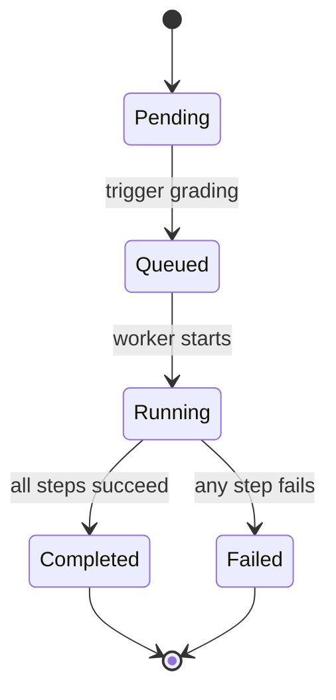
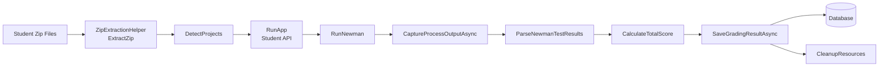
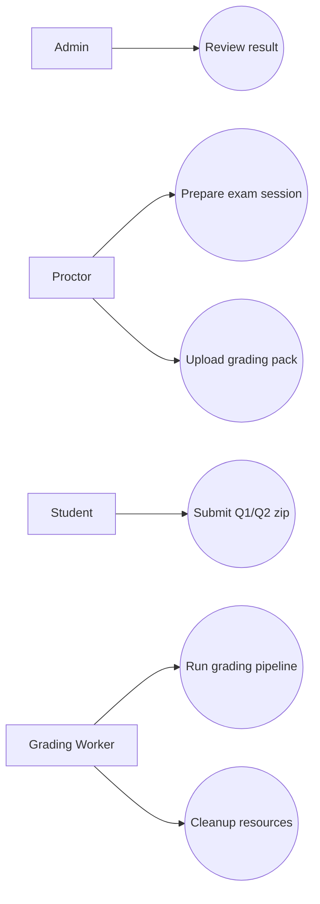
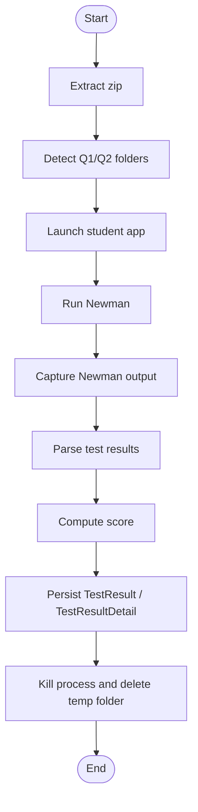
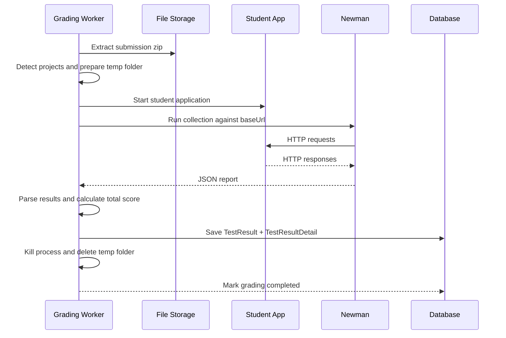

# Workflow Overview - PRN232 Auto Grading Tool

This document summarizes the workflow we completed for the grading pipeline and presents it in several diagram styles for quick review.

## Scope

The implemented workflow covers these steps:

1. Extract submission zip files.
2. Detect `Q1_*` and `Q2_*` project folders.
3. Run the student application with `dotnet`.
4. Load test cases from the database.
5. Build Newman request items.
6. Build Newman test scripts.
7. Build the Postman collection JSON.
8. Run Newman against the student app.
9. Capture Newman stdout/stderr output.
10. Parse Newman JSON into structured result details.
11. Calculate total score from passed test cases.
12. Save `TestResult` and `TestResultDetail` to the database.
13. Clean up temporary folders and processes.

## State Diagram

The submission grading state is a simple lifecycle:

## Logical Diagram

This diagram shows the logical components and how the grading pipeline moves data between them:

## Use Case Diagram

Main actors and their responsibilities:

## Activity Diagram

This diagram shows the operational activity sequence inside the grader:

## Start-to-Finish Sequence Diagram

This is the diagram type that shows how the workflow starts and completes across components. It is the clearest view of the whole pipeline from trigger to cleanup.

## Result Model

The completed backend now stores grading output using the result model:

- `TestResult` stores the submission-level total score and overall test status.
- `TestResultDetail` stores each parsed test case result, including pass/fail, score, response time, and raw output.
- The submission read API returns `resultDetails` to the frontend.

## Notes

- The workflow is task-driven and completed in order from T01 to T13.
- The grader is designed to be data-driven from database test cases, not hardcoded per exam.
- Cleanup is best-effort so temporary files and processes do not leak across runs.