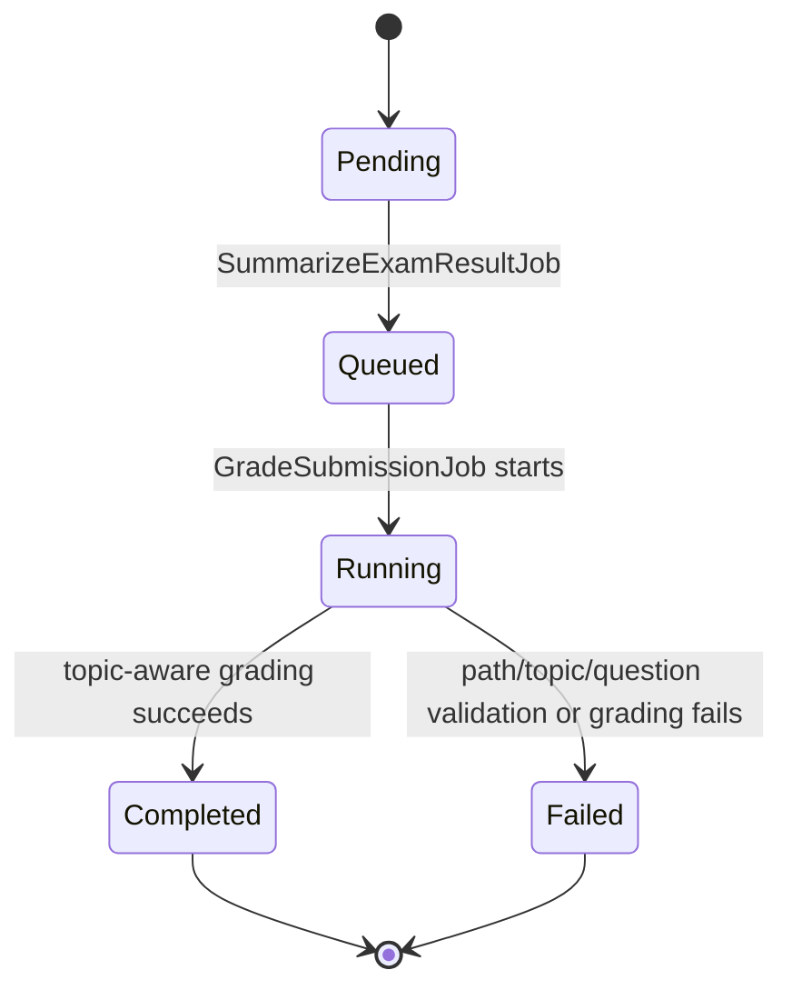
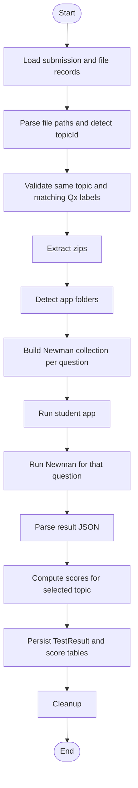
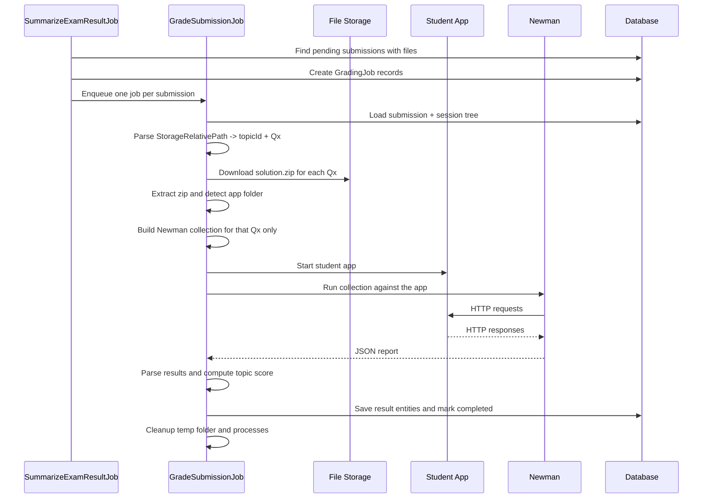

# Workflow Overview - PRN232 Auto Grading Tool

This document summarizes the current grading pipeline after the topic-aware update.

## Scope

The grading workflow now covers these steps:

1. `SummarizeExamResultJob` wakes up at `ExamSession.EndsAtUtc`.
2. It finds pending submissions that already have `ExamSubmissionFile` records.
3. It creates one `GradingJob` per submission and enqueues `GradeSubmissionJob`.
4. `GradeSubmissionJob` loads the submission and its file records.
5. The job parses each `ExamSubmissionFile.StorageRelativePath`.
6. The job detects the target `ExamTopic` from the `{topicId}` segment in the path.
7. The job validates that all files in one submission belong to the same topic.
8. The job validates that the `/Qx/` folder in the path matches `ExamSubmissionFile.QuestionLabel`.
9. The job extracts each `solution.zip`.
10. The job finds the published app folder for the matching question label.
11. The job builds a Newman collection only for the matched `ExamQuestion`.
12. The job runs Newman separately for each submitted question app.
13. The job parses Newman JSON into structured result details.
14. The job computes scores only from the selected topic's questions and test cases.
15. The job saves `TestResult`, `TestResultDetail`, `ExamQuestionScore`, and `ExamTestCaseScore`.
16. The job cleans up processes and temporary folders.

## Storage Path Contract

Submission zips are stored with this contract:

```text
session.Code/{topicId:N}/{studentFolder}/Qx/solution.zip
```

Example:

```text
PRN232-DEMO-PE/b1000000-0000-4000-8000-000000000003/HE186501_NguyenVanA/Q1/solution.zip
```

The grader may also receive a storage-provider prefix such as `uploads/`, but the topic-aware parser still resolves the path using the `session.Code/.../Qx/solution.zip` tail.

## State Diagram



## Logical Diagram

```mermaid
flowchart LR
    Session[ExamSession + Topics] --> Summary[SummarizeExamResultJob]
    Summary --> Job[GradeSubmissionJob]
    Job --> Path[Parse StorageRelativePath]
    Path --> Topic[Resolve ExamTopic + Qx]
    Topic --> Extract[Extract solution.zip]
    Extract --> App[Detect publish folder]
    Topic --> Collection[Build Newman collection per question]
    App --> Newman[Run Newman]
    Collection --> Newman
    Newman --> Parse[Parse JSON report]
    Parse --> Score[Compute topic-only scores]
    Score --> Save[Persist result entities]
    Save --> DB[(Database)]
    Save --> Cleanup[Cleanup temp resources]
```



## Activity Diagram



## Sequence Diagram



## Result Model

- `TestResult` stores the submission-level total score and overall status.
- `TestResultDetail` stores detailed pass/fail and timing data per executed test case.
- `ExamQuestionScore` stores score by question in the resolved topic.
- `ExamTestCaseScore` stores score by test case in the resolved topic.

## Notes

- `SummarizeExamResultJob` still creates one `GradingJob` per `ExamSubmission`.
- Topic detection is driven by `ExamSubmissionFile.StorageRelativePath`, not by adding a new topic column to `ExamSubmission`.
- Question mapping is driven by `ExamSubmissionFile.QuestionLabel` matched against `ExamQuestion.Label` inside the resolved topic.
